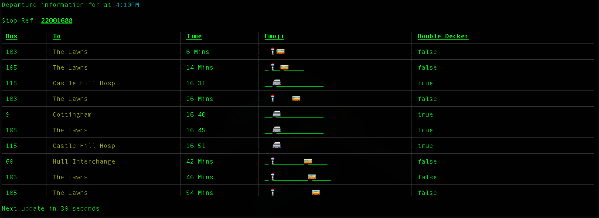

# busterm
View all the NapTAN buses directly in realtime in the terminal!



If you have Go installed:

`$ go get github.com/return/busterm`

Release binaries will be available soon.

TODO:

- [x] Refine API (with parameters.)
- [x]  Enhanced terminal interface.
  - [x] colours!
  - [ish] TUI.
- [ish] Real time updates!
- [ ] Configurable intervals.
- [ ] Form entry.
- [ ] Postcode2NapTAN.

### Usage
```
Usage:
	busterm [-t] -n <code> | --naptan <code> [<interval>] 
	busterm -a | --api
	busterm -h | --help
	busterm --version
```

### License
MIT


